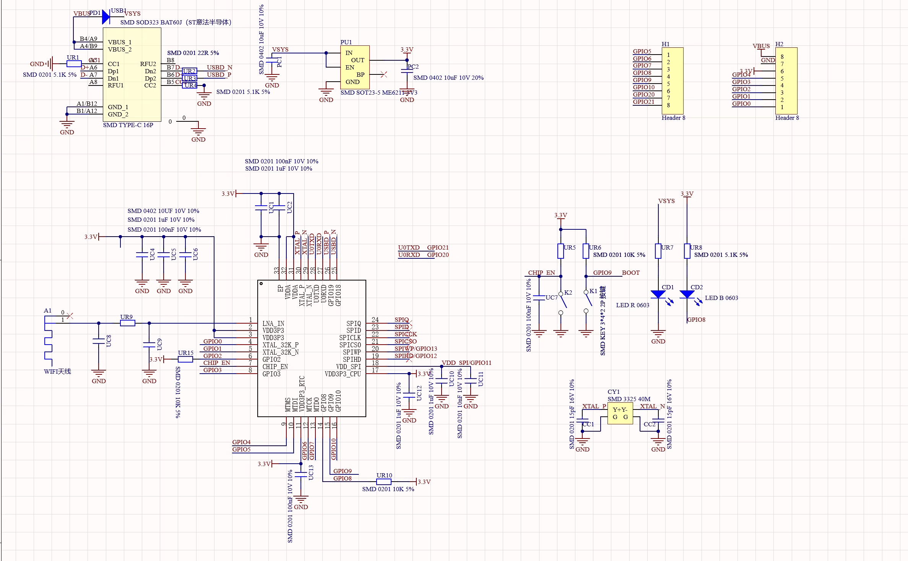

# ⚡ ESP32-C3 Core Module Introduction

This document provides a detailed overview of the ESP32-C3 core module, including its technical specifications, hardware resources, and critical operating instructions.

---

## ⚙️ 1. Product Specifications

The core module is built around the highly integrated ESP32-C3 chip, offering robust Wi-Fi and Bluetooth capabilities in a compact design.

| Feature | Specification |
| :--- | :--- |
| **Processor** | ESP32-C3, 32-bit RISC-V Single-Core CPU |
| **Frequency** | Up to 160 MHz |
| **Wi-Fi** | 802.11 b/g/n, 2.4 GHz (Station, SoftAP, SoftAP+Station, Promiscuous) |
| **Bluetooth** | Bluetooth 5.0 (BLE) |
| **Low Power** | Deep-sleep current approx. 43 $\mu$A |
| **Memory** | 400 KB SRAM, 384 KB ROM, Built-in 4 MB Flash |
| **Chip Model** | ESP32C3FN4 |
| **Size** | 23 $\times$ 19 mm classic form factor |
| **Design** | Single-sided components, Surface Mount Design (SMD) |
| **Onboard Blue LED** | Connected to **GPIO8** |

---

## 🔌 2. Rich Peripheral Interfaces

The module provides a rich set of I/O and communication interfaces:

* **General Purpose I/O (GPIO):** 11x (PWM capable)
* **Analog Input:** 4x ADC (Analog-to-Digital Converter)
* **Serial Communication:** 2x UART
* **Synchronous Communication:** 1x I2C, 1x SPI

### 2.1 Pinout Diagram

The following diagram illustrates the pin assignment and peripheral mapping for the core module:

 

---

## ⚠️ 3. Operational Notes and Instructions

### 3.1 External Power Supply

* If external power is required, connect the **Positive (+)** terminal of the external supply to the **5V** pin, and the **Ground (GND)** terminal to the negative pole.
* **Supported Range:** The module supports a voltage range of **3.3V to 6V**.
* **Crucial Warning:** When connecting an external power supply, **USB power must be disconnected**. USB and external power are mutually exclusive; use only one source to prevent damage.

### 3.2 Entering Download Mode (Flashing)

The chip must be manually set to Download Mode before flashing new firmware (required for each new connection/flashing session).

1.  **Press and Hold** the **BOOT** button on the ESP32-C3 module.
2.  **Press** the **RESET** button.
3.  **Release** the **RESET** button.
4.  **Finally, Release** the **BOOT** button.

The ESP32-C3 should now be in Download Mode. If the port disconnects unexpectedly (sometimes indicated by a port recognition sound), you may need to repeat the sequence.

---

## 💡 4. Schematic Diagram (原理图)

For hardware replication, debugging, and detailed component inspection, please refer to the schematic diagram.

The full schematic is provided in the repository's documentation files:

 

