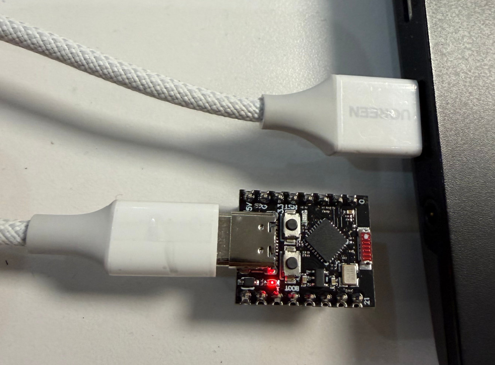
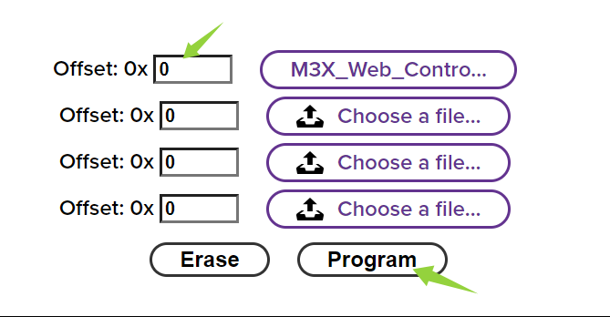

# 💻 ESP32-C3 Firmware Flashing Guide (Beginner's Edition)

This guide provides **step-by-step instructions** for flashing the M3X control firmware onto your ESP32-C3 core module using the simple, browser-based **Adafruit WebSerial ESPTool**.

---

## ⚙️ 1. Preparation Checklist

Ensure you have all the necessary components and files before proceeding:

1.  **Core Module:** An **ESP32-C3 Super Mini** core board.
2.  **Cable:** A reliable USB Type-C data cable.
3.  **Firmware File:** The specific `.bin` file you need to flash.
    * **File Location in this Repository:** `Firmware\01_Web_Touch_Console\M3X_Web_Control_v1.0.bin`
    * **Function:** This firmware allows you to control the M350 via a web interface or mobile phone using the core board's Wi-Fi hotspot.
4.  **Browser Tool:** The online flashing tool.
    * **Tool URL:** [https://adafruit.github.io/Adafruit_WebSerial_ESPTool/](https://adafruit.github.io/Adafruit_WebSerial_ESPTool/)
    * **Requirement:** Use a Chromium-based browser (Google Chrome or Microsoft Edge).

---

## ⚠️ 2. Essential Setup: Enter Download Mode

Before your computer can communicate with the ESP32-C3 for flashing, the module must be placed into a special **Download Mode** (also called Bootloader Mode).

### Procedure:

1.  **Connect the Cable:** Plug the USB Type-C cable into the module and your computer.
 

2.  **Locate Buttons:** Identify the **BOOT** button (usually near the USB port) and the **RESET** button.
3.  **Press BOOT:** **Press and HOLD DOWN** the **BOOT** button (Do not release yet!).
4.  **Press RESET:** While holding BOOT, briefly **PRESS and RELEASE** the **RESET** button.
5.  **Release BOOT:** Wait for about one second, then **RELEASE** the **BOOT** button.

> **Crucial Note:** This manual procedure is required **every time** you start the flashing process. If you encounter errors later, repeat these steps immediately before reconnecting.

---

## 🚀 3. Step-by-Step Flashing Procedure

Follow these steps precisely to successfully burn the firmware:

### Step A: Set Baud Rate and Connect the Device

1.  Open the **Adafruit WebSerial ESPTool** URL in your browser: [https://adafruit.github.io/Adafruit_WebSerial_ESPTool/](https://adafruit.github.io/Adafruit_WebSerial_ESPTool/)
2.  **Set Baud Rate:** Locate the baud rate selection dropdown menu (usually near the top right corner). **Select `115200`**.
    > **Note on Baud Rate:** While the tool might support faster rates, **115200** is the standard, most reliable rate for the initial connection and stability across different computer systems.
3.  Locate the large **CONNECT** button (usually blue) on the page and click it.
4.  A pop-up window will appear, listing available serial ports.
5.  **Select Port:** Choose the port that corresponds to your ESP32-C3 (e.g., 'USB to UART').
6.  **Confirm Connection:** Click **Connect**. The button should change to **DISCONNECT** if successful.
    * *(If the tool fails to connect, ensure the module is in Download Mode (Section 2.1).)*

### Step B: Load the Firmware File

1.  After connecting, look for the **"Files to flash"** section on the page.
2.  **Set Start Address:** Ensure the address field is set to **`0x0`** (zero).
    * **Start Address Value:** `0`
 
    
3.  **Select File:** Click the **Browse** button next to the address field.
4.  A file explorer window will open. Navigate to the firmware file **`M3X_Web_Control_v1.0.bin`** in your local clone of the repository.

### Step C: Execute Flashing

1.  Once the file is selected and the address is confirmed, click the **Program** button.
2.  **Monitor Progress:** The tool will automatically start erasing the old firmware and writing the new `.bin` file. Watch the progress bar in the log window.
3.  **Wait for Success:** The process is complete when you see a bright green **"Success!"** message in the log area. **Do not disconnect the cable until this message appears.**

### Step D: Disconnect and Run

1.  Click the **DISCONNECT** button on the web tool interface.
2.  **Run Firmware:** Briefly press the **RESET** button on the ESP32-C3 core board.

The module will exit Download Mode and immediately begin running the new `M3X_Web_Control_v1.0.bin` firmware. Your core module is now ready to broadcast its Wi-Fi hotspot for M350 control.