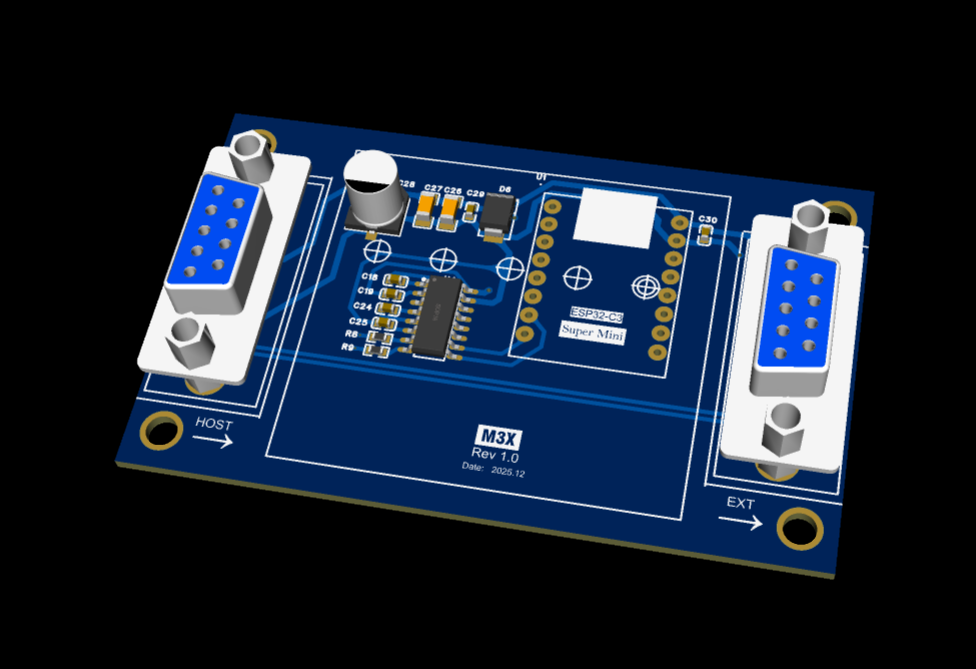
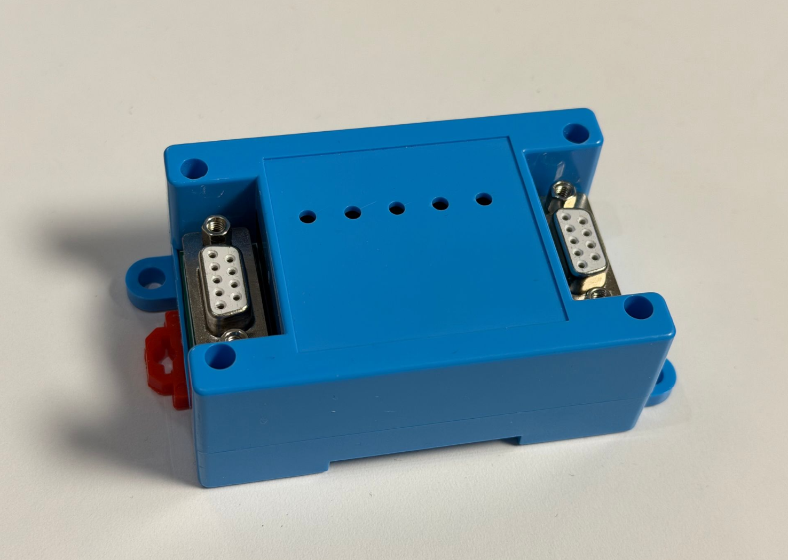
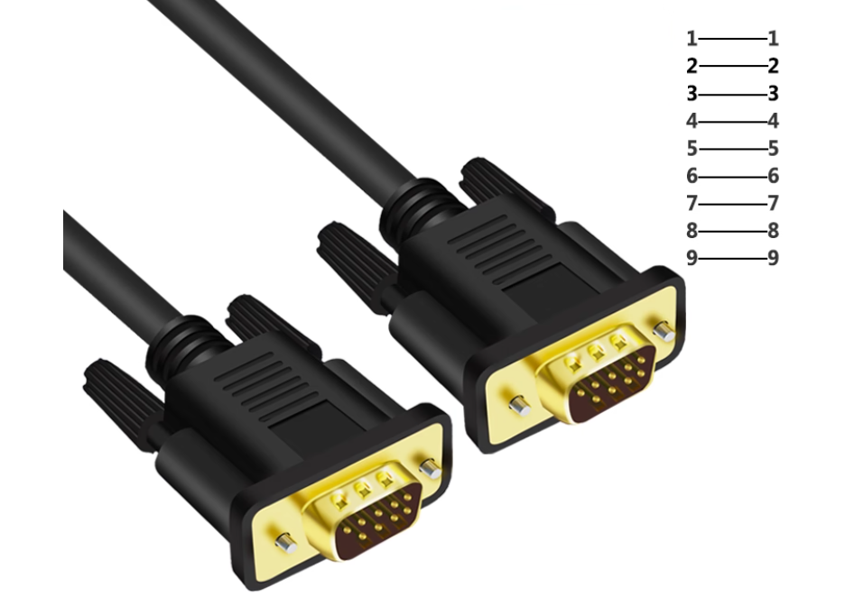
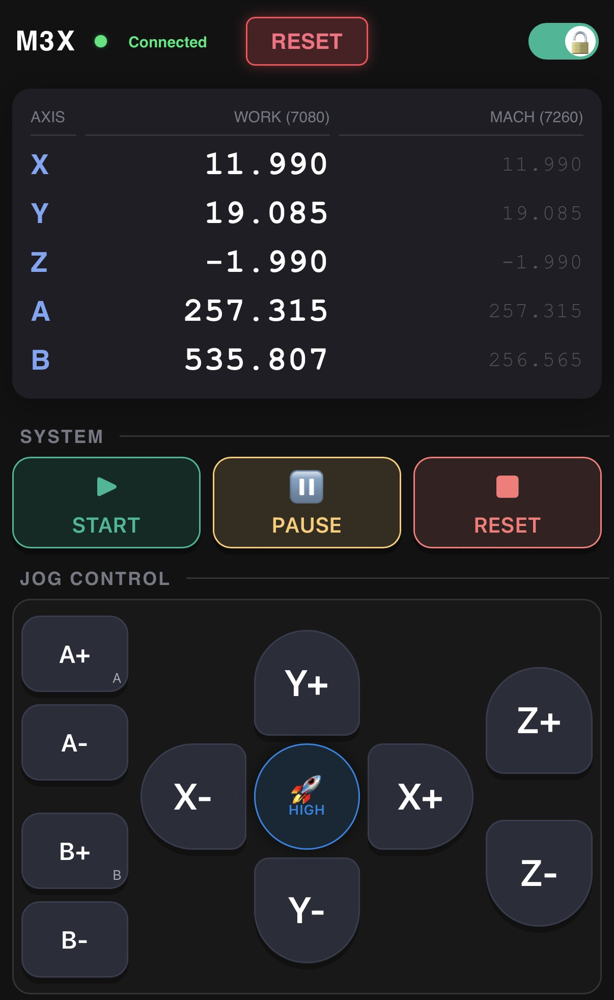

# 🌉 M3X-M350-IoT-Bridge

**An Open Source IoT Expansion Box designed exclusively for the M350 CNC Controller.**

 
---

## ✨ 1. Project Overview: Unleash Wireless Imagination

The **M3X-M350-IoT-Bridge** is an open-source hardware project designed to empower the classic M350 CNC controller with modern **IoT (Internet of Things)** capabilities.

By integrating powerful **Wi-Fi** and **Bluetooth** wireless protocols, the M3X box acts as a bridge, allowing various Human-Machine Interfaces (HMI) and wireless terminals to access the M350 system.

**With the M3X, your M350 gains:**
* **Wireless Freedom:** Replace wired limitations with Wi-Fi/Bluetooth control.
* **Smart Connectivity:** Supports standard wireless protocols for flexible development.
* **Expanded Potential:** From simple remote jogging to complex cloud monitoring, unleash the wireless imagination of your CNC system.

### 📷 Product Visualization

 

*(Note: The M3X is compact, robust, and designed to sit neatly beside your controller.)*

---

## 🔌 2. Connectivity & Power

We designed the M3X for ultimate simplicity. **Zero soldering, Zero complex wiring.**

* **Connection Method:** Connects via a single **DB9 Male-to-Male Extension Cable**.
* **Plug and Play:** Simply plug one end into the M3X and the other into the M350's serial port.
* **Power Supply:** No external power adapter is needed! The M3X draws 5V power directly from the M350 controller through the DB9 cable.

 

---

## 💻 3. Hardware Compatibility

The M3X is compatible with the majority of M350 controllers in the market:

| Hardware Version | Compatibility Status | Note |
| :--- | :--- | :--- |
| **M350 V2** | ✅ **Fully Compatible** | All V2 hardware versions support direct power and data. |
| **M350 V1** | ⚠️ **Partial Support** | Only V1 versions equipped with a **5V output** on the serial port are supported. |

---

## 📱 4. Application Case: Wi-Fi Web Control

The M3X allows you to control the CNC remotely via a web interface.

> **📢 Prerequisite (Important):**
> Before attempting to communicate with the M350, you must flash the firmware into the IoT Box.
>
> Please follow the [**Firmware Flashing Guide**](Docs/Flashing_Guide.md) to flash the `M3X_Web_Control_v1.0.bin` file to your device first.

### How to Use:

1.  **Power On:** Turn on your M350 (and thus the M3X).
2.  **Connect Wi-Fi:** On your Phone, Tablet (iPad/Android), or Laptop, search for the Wi-Fi hotspot.
    * **SSID (Name):** `M3X`
3.  **Open Browser:** Launch any web browser (Chrome, Safari, Edge, etc.) and enter the address:
    * **URL:** `192.168.4.1`

**You now have a wireless CNC control panel right in your hand!**

---

## ⚙️ 5. M350 System Configuration (Critical Setup)

For the M3X to communicate successfully, you **must** configure the M350 CNC Controller's internal parameters as follows.

**Go to the M350 "Parameters" page and set:**

| Parameter No. | Parameter Name | Setting Value | Description |
| :--- | :---: | :---: | :--- |
| **P279** | **Modbus RTU** | **Slave** | Sets M350 as a Modbus Slave (Server). |
| **P267** | **Serial 2 Baud Rate** | **115200** | Matches the M3X high-speed communication rate. |
| **P296** | **Parity Check** | **Default** | Leave as system default (Usually None/Even). |
| **P297** | **Stop Bits** | **Default** | Leave as system default (Usually 1 bit). |

> ⚠️ **IMPORTANT:** After changing these parameters, you **MUST REBOOT (Restart)** the M350 controller for the changes to take effect.

---

## 🎬 6. Demos & Gallery

See the M3X in action!

### Video Demonstration
[**▶️ Click here to watch the M3X Setup & Demo Video**](YOUR_VIDEO_LINK_HERE)

*(Or use the thumbnail embed method below)*

### Project Gallery

*(Caption: The responsive web interface on a smartphone)*

*(Caption: The M3X bridge connected to the M350 CNC controller)*

---

## 📚 Documentation & Resources

* **Flash Firmware:** [Firmware Flashing Guide](Docs/Flashing_Guide.md) - Step-by-step flashing instructions.
* **Hardware Details:** [ESP32-C3 Core Module Introduction](Docs/ESP32_C3_Core_Introduction.md) - Pinouts and specs.
* **Source Code:** Check the `Firmware/` folder for source code examples.
* **Schematics:** Check the `Hardware/` folder for circuit diagrams.

---

_Open Source Project - Use at your own risk and enjoy the freedom of DIY!_